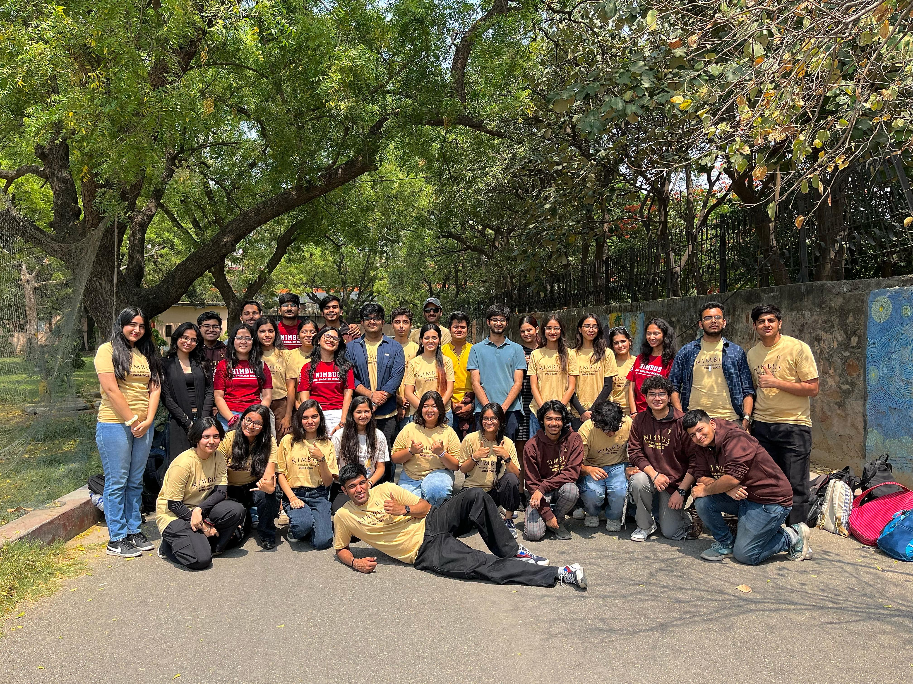

# About Nimbus

Nimbus is the English Debating society of ARSD college, Delhi University. We are proudly one of the premiere debating societies of the Delhi University debating circuit.

The perfect society for public speaking enthusiasts who want to find their place across diverse speaking formats: starting from Parliamentary and Conventional debate formats to MUNs and policy debates. Nimbus boasts a long running award legacy in all formats.

The society also hosts multiple inter-varsity and intra events ranging from Conventional debates, fundraisers to MUNs. The flagship event of the society is our annual parliamentary debate event called "Ehsaas" which hosts a footfall averaging 200 debators and adjudicators from all across the circuit and pan-India. This makes the society a wonderful option even for people seeking organisational capacity rather than just debating. 

 

{width=800}