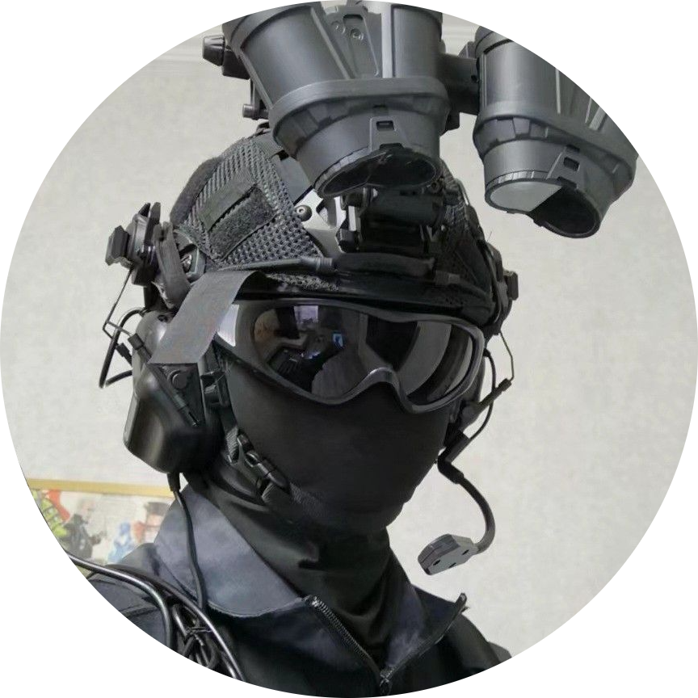

# Welcome

This is a knowledge repository that will store years of cumulated knowledge related to debating and Munning ranging from debating manuals and guide PDFs to helpful youtube videos and debating mech notes. 

This e-repository was created as a solution to the need of a consolidated system that were cuts above solutions such as google drive or Notion CMS, with an indexing-friendly & accessible UI, open source and sustainable. 

## Categories

* `Resources/Articles`: Writeups covering current affairs, politics, economics and other useful debating mechs.
* `Resources/guides`: BP/AP/CD debating guides and role fulfilment guides
* `Resources/videos`: Videos across youtube that provide useful drill run or debate mech resources
* `Resources/MUN`: MUN centric content

## Mantainers

{width=80 align=left}
### [**D3FALT**] Priyongshu Paul - Secretary of Nimbus