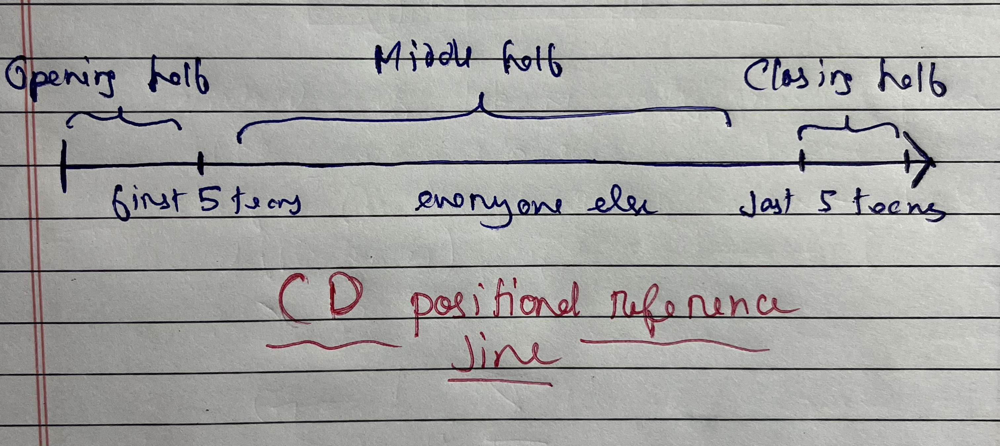
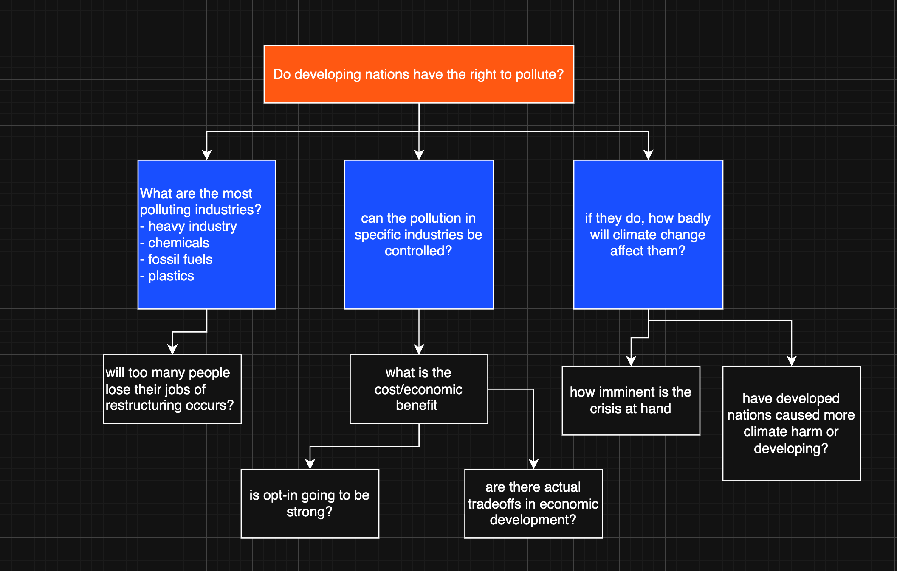

# Conventional Debate

Among the many styles of debating, the Conventional Debate (CD) remains a classic format — simple, structured & widely used in schools, colleges & in several national/international level competitions. CDs are one of the shortest yet most fun forms of debating. It allows participants to express their viewpoints clearly while maintaining a sense of discipline and fairness. The goal is not just to state opinions but to convince the listener through persuasive communication & logical arguments within a stipulated period of time. 

## Format guide

* Each team consists of 2 speakers - one from side Proposition(for the motion) & another from side Opposition(against the motion).

* In this format, each speaker gets 3 minutes to present their arguments. Once the speech ends, a 1-minute interjection round follows, where either the judges or audience may ask a question related to the speech.

**Tournament structure**

1. Opening: The competition begins with a short introduction of the topic and the rules by the moderator. They ensure timekeeping and maintain the decorum throughout.

2. Speeches: Each speaker presents their arguments logically and persuasively within the 3 minute time limit. The Proposition always speaks first, followed by the Opposition.

3. Interjection Round: After each speech, a brief interjection period of 1 minute allows the judges or audience to ask a question related to the content. The aim is to assess the speaker’s depth of understanding and ability to think spontaneously. 

4. Conclusion/closing remarks: Once all speakers have presented, the judges may provide closing comments or feedback.

**Evaluation criteria**

Here are the key metrics on which speeches are largely evaluated : 

1. Content i.e. strength and clarity of arguments.
2. Evidence i.e. Use of facts, statistics, and examples.
3. Rebuttal i.e. Ability to counter the opponent’s points.
4. Delivery i.e Confidence, tone &  body language.
5. Organization i.e. Logical flow and structure.
6. Critical Thinking & Unique Ideas which set you apart from other speakers 

## Positional strategies

In a CD debate, your team slot is at the mercy of the OrgComm. Add to the fact that many Conventional Debate tournaments in the Delhi circuit especially are legacy and hence draw upto 30-40 teams in a single tournament. This means your debate can be easily drowned out by derivative content or lack of analysis and rhetoric. In a Parliamentary debate, metrics such as proper speaking composure, stature, fluency and rhetorics do not hold weight in the marking, but in a Conventional Debate they do and more than often will take over content as the winning metric of the debate. 

Now as we talked about how your team slot will be at the mercy of the OrgComm, your position in the debate will determine your speaking strategy largely. There are broadly 3 positions you can have in a debate: **Opening, Middle Half, Closing** 

**NOTE**: the illustration below assumes a minimum cap of 20+ teams

{width=600}

### 1. Opening Half

At the beginning of the line, the first demarcator is the first 5 teams (make it 3 for debates below 15 teams) which are the Opening teams. The Opening teams largely debate on the definitions of the debate and setup the prime clashes.

As an opening/moving team focus on **Worldbuilding**. Out of the 3 mins, spend at least a minute and max minute 15 seconds setting up what the world looks like, where the status quo stands and what are the core issues of the world that the debate has to revolve around. Let us take for example the CD motion: **"THBT developing nations have the right to use carbon and carbon emissions causing products"**. 

Government side on this motion, on the opening half will setup the status quo for the developing nations that solidifies their need to carbon pollute when developed nations have historically already carbon polluted enough to accelerate their development during the industrialisation age. Gov can also setup international agreements such as the CBDR from Rio agreement as a key denominator for policy in this regard. 

Note that rather than challenging Gov's definition, the Opposition is better off taking the debate [one level above the actor](../articles/nation.md) and arguing from the lens of climatic needs getting more urgent and how the imminent fermi paradox of extreme weather does not care about metrics of ratifications embedded in international agreements, hence putting the immediate strain on developing nations to take corrective action for the sake of the greater good.

This worldbuilding on both sides then creates space for core arguments to follow. On opening half your argument has to be broad, but the analysis should cover enough depth that it renders the following teams largely **derivative**, which means most debate presented by the teams next to you feel like they just repeated your content with paraphrased or extended analysis/rhetorics.

Doing this can be challenging for novice debators, but can be mastered over time easily. A broad argument will address **the key issue(s)** which is recognised by all the teams equally and sets up the core clash of the debate. For example in context of the above motion, the core clash is whether or not developing nations have the right to pollute. This covers a lot of nuances such as how the pollution occurs, how has mitigation occured, how climate promises have worked out etc. Gov bench can focus on the assymetric harm done on the development capacity of Developing nations while Opp team focuses on the impending climate crisis. The core clash can also be extended to the nature of the climate crisis at hand and how much difference would be made if developing nations focused on cutting carbon emissions rather than exacerbating them for development purposes. 

The opening half sets up the world and the core issues of the debate, which a middle half team then carries forward.

### 2. Middle half

Being a team positioned in the middle half means you need more **analytical depth** in your arguments. The core issue of the debate have already been set up by the opening teams. However if you feel that the opening teams have misplaced the debate (the worldbuilding was not incomplete, the core issues were not addressed), you can call this out and speak corrective content, giving a renewed direction to the debate at hand. This mechanism is very effective and sets you apart from the opening however make sure to wrap this part up within 30-45 seconds of your speech. 

Assuming that core issues have been setup well, you now take up the role of setting up tipping points within each argument. A **tipping point** is an argument, analysis or weighing that basically veers the debate to one side. Let us take the same motion in context and the core issue of "do developing nations have the right to pollute?". Now we break down (branch out) this core issue into smaller questions that can give more analytical depth. An example breakdown is given below

{width=600}

What questions you choose to answer should depend on what gives you the best advantage in the debate. If I am going down the path of explaining "why too many people will lose their jobs due to restructuring" on the gov side I will analyse why all the job losses will occur and why is it always likely to occur with no way around it because of existing rigorous industrial structure and practices, and how it will eventually offset any economic benefit that the opp might be pushing because too many people are getting cut out of the workforce to opt into the economic benefit. This is the mechanism of **"pushing an exclusive harm"** which airtights your analysis and makes shit difficult for the opposing bench, provided you you have sound logic. 

As a middle half team, especially if you are one of the later middle half teams (just before the last half) its beneficial if you enter into some form of **weighing**. Weighing is basically "why does this argument matter?". The purpose of weighing is to establish the importance of your arguments over the other bench's. Read further about weighing [here](https://debateus.org/weighing/)

!!! note

    A clever way to leverage impacting is also to dilute the benefits of the opposing bench, especially if they have a very good well analysed argument that you dont know how to rebut because its logically airtight, a clever general debating trick is to simply explain how their argument falls on impact. i.e no stakeholder benefit, no solvency.

Additionally spend a fair amount of time in rebuttals as actual engagement and response matters a lot atp. Your case can only be strong if it cuts down the opposition's at their strongest. A common mistake is debators keeping rebuttals exclusive from their argumentation content. Your arguments should basically pave way for the rebuttals. For example - "[argument xyz] happens because of [analysis A] which rebuts opposition's abc"; or alternatively "a core rebuttal to opp's analysis about xyz is ... which brings me to my argument abc". These are rough structures you can play around with them. The point is for your speech to have a homogenous interlinked structure and not be mutually exclusive unrelated blocks of text.

### 3. Closing half

Unless the debate has been absolute shit, there are very good chances that you have run out of most content by now. The adjes are tired and so is everyone else. Here rhetorics, composure and voice have to play a major role in your speech if you want to win.

Here is the contingency based path you take now based on the question: "Are there arguments left out?"

**If your answer is yes**

If the argument/analysis is new and has not been said before, ask yourself if introducing them this late into the debate adds anything substantively. Is this leftover content good enough to be a **tipping point**? If your answer to this question is a confident yes, introduce the content while explaining why the argument holds relevance in the debate more than the previous content. Basically implicitly weighing your argument against everyone else including your own bench's.

**If your answer is no**

You might be slightly cooked, but fret not the best course of action from here is to incorporate rebuttals and weighing as a major part of your speech. You are now basically a PD whip speaker where you will summarise the debate for the judges and say why your side is winning instead and on what metrics. 

[Weighing](https://debateus.org/weighing/) is an inalienable part of the closing half, do this even if the answer was yes. The best thing you can give the judges at this point is solvency. They want this solvency because they already have a shit ton of content on their pages or none at all if the debate was bad, either ways you are going to help the judges tip the debate towards your side.

Pick out two, minimum one important core clash in the debate, pick out the best supporting analysis given by the other bench and then tear it apart with rebuttals. Do not pick out weak parts of their case as its not going to give you any major points. Break down their case at the strongest. Keep rebuttals concise as the next part is more important.

After that you move on to weighing, go back to the diagram on the previous section and take a look at the blue boxes. Take these as the core content of the debate which creates tipping point. Start weighing/impacting this core content because it creates the best impact. You can use techniques like a "World's analysis" where you explain why even the worst case scenario on your side is still better than the best case scenario acheived by the opposing bench. In the context of this motion it will look like why even the worst case scenario that occurs by Developing nations continuing to economically develop at the expense of rising carbon emissions will still result in a better world for all stakeholders involved than the "comparatively best world" that is created by shedding development rate for cutting carbon emissions. 

From here on just use your brain, you made it this far in life because you probably have one.

